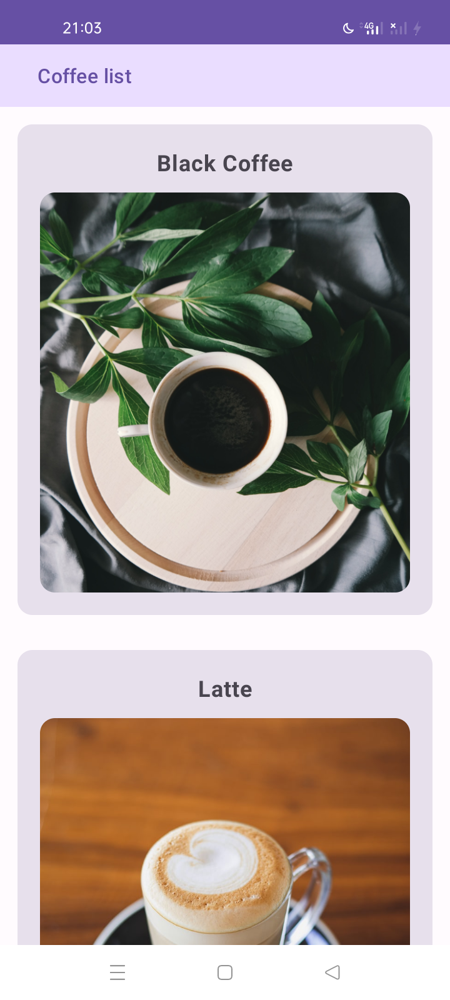
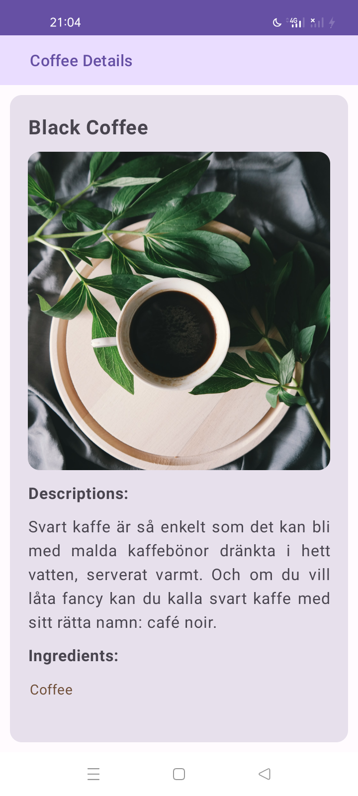
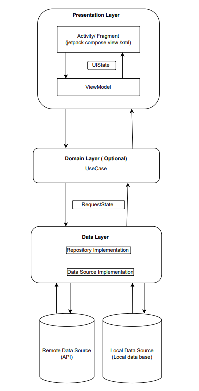

# ModularMVVMCleanArchitecture
Coffee App developed using sample api 

This concept consists of structuring the App in 3 separate modules:
* **app/features**: Android module that contains the Android _Application_ component and all the framework specific configurations. It has visibility over all the other modules and defines the global dependency injection configurations. App module Presententation contains the Android UI framework components (_Activities_, _Composables_, _ViewModels_...) and the related resources.
* **domain**: Kotlin module that represents the _domain layer_. It contains _Use Cases_ (platform-independent business logic), the _Entities_ (platform-independent business models) and the _Repository interfaces_.
* **data**: Android module that represents the _data layer_. It contains _Repositories_ implementation, the data source _Api_ implementations and the corresponding api-specific models.

## Screen shot of CoffeeApplication
The Screen shot flow is shown by the picture below:
   

   

## MVVM Modular Architecture Design
   

   
